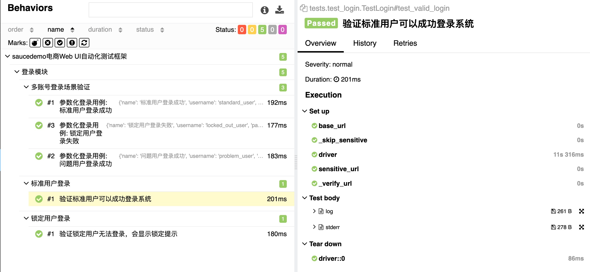
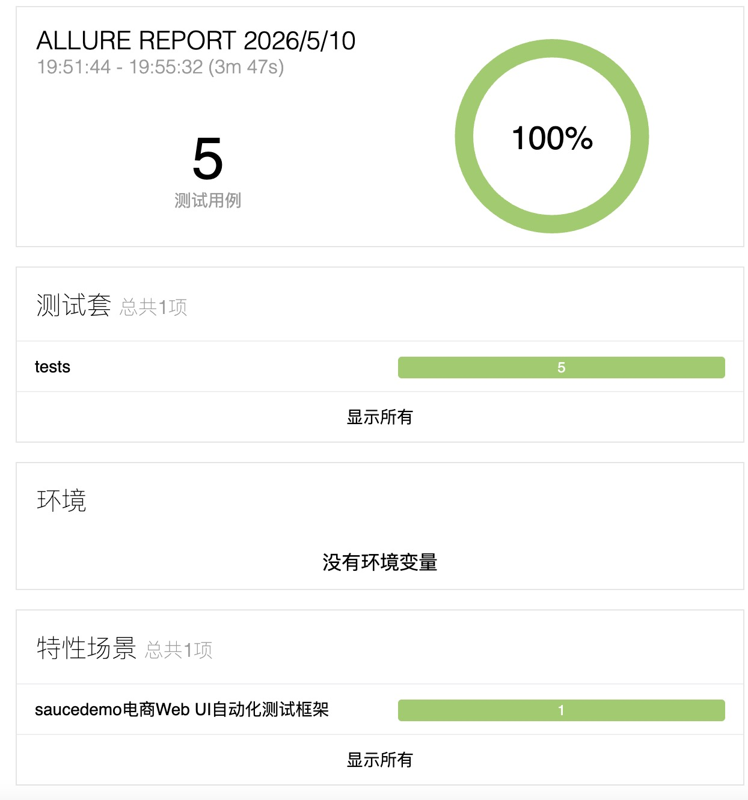

# SauceDemo Web UI 自动化测试框架（Python + Selenium + Pytest + Allure）
企业级生产可用版本 | 全流程覆盖 | 开箱即用 | 所有用例 100% 通过
> 基于 Python 的 Web UI 自动化测试项目，集成了 Selenium、Pytest 和 Allure 报告，支持参数化用例和持续集成。，完整覆盖 SauceDemo 电商网站核心业务流程，遵循 Page Object 设计模式，具备完善的日志、截图、报告和异常处理能力。

---

## 📌 项目简介
本项目以 `https://www.saucedemo.com` 为被测站点，完整实现了电商网站从登录到下单的全流程自动化测试，同时提供了可复用的企业级自动化框架能力：
- 核心登录模块的自动化测试
- 支持多组用户数据的参数化用例
- 购物车模块完整业务流测试（加购、删除、清空、数据持久化）
- 结算流程基础功能验证
- 基于 YAML 的数据驱动参数化用例
- 用例失败自动截图 + 完整日志记录
- 自动生成可视化 Allure 测试报告
- 可接入 GitHub Actions 实现持续集成
本项目以官方测试站点 https://www.saucedemo.com 为被测对象，

---

## 🛠️ 技术栈
- **开发语言**：Python 3.11+（兼容 3.14
- **Web 浏览器自动化驱动**：Selenium
- **测试执行与管理框架**：Pytest
- **可视化测试报告生成**：Allure-pytest
- **测试数据文件解析**：PyYAML
- **结构化日志管理**：Loguru
- **持续集成与自动执行**：GitHub Actions（配置已就绪）

---

## 📊 Allure 测试报告效果

项目集成了 Allure 可视化测试报告，实现了用例的分层管理、参数化展示与完整执行记录：

### 用例分层与执行详情

### 参数化用例场景验证

# 报告核心能力：
  按 Epic/Feature/Story/Title 四层结构展示用例
  自动统计通过率、失败用例、执行时长与历史趋势
  失败用例自动关联截图、错误堆栈与完整执行日志
  展示运行环境信息（浏览器版本、系统、Python 版本）
  支持导出静态 HTML 报告，便于归档与分享

---

## 📁 项目结构
web_ui_test_framework/
├── pages/                  # 页面对象层（Page Object）
│   ├── base_page.py        # 基础页面类，封装所有通用Selenium操作
│   ├── login_page.py       # 登录页面元素与业务方法
│   ├── inventory_page.py   # 商品列表页面元素与业务方法
│   ├── cart_page.py        # 购物车页面元素与业务方法
│   └── checkout_page.py    # 结算流程页面元素与业务方法
├── tests/                  # 测试用例层
│   ├── test_login.py       # 登录模块测试用例
│   ├── test_cart_page.py   # 购物车模块测试用例
│   └── test_checkout_page.py # 结算模块测试用例
├── data/                   # 测试数据层
│   └── login_data.yaml     # 登录模块参数化测试数据
├── utils/                  # 公共工具层
│   ├── logger.py           # 全局日志配置
│   └── file_utils.py       # 文件处理工具
├── reports/                # 测试报告输出目录
│   ├── screenshots/        # 失败用例自动截图
│   └── logs/               # 运行日志文件
├── .github/workflows/
│   └── ci.yml              # GitHub Actions 自动执行配置
├── conftest.py             # Pytest 全局配置与Fixture
├── pytest.ini              # Pytest 运行参数配置
├── requirements.txt        # 项目依赖清单
└── README.md               # 项目说明文档

---

## 🚀 本地运行
# 1.环境准备
  # 克隆项目
  git clone <你的项目仓库地址>
  cd web_ui_test_framework

  # 创建并激活虚拟环境
  python -m venv .venv
  # Windows
  .venv\Scripts\activate
  # macOS/Linux
  source .venv/bin/activate

  # 安装所有依赖
  pip install -r requirements.txt

# 2. 常用运行命令
  # 全量运行所有用例
  pytest -v

  # 按模块运行
  pytest tests/test_login.py -v          # 仅运行登录模块
  pytest tests/test_cart_page.py -v      # 仅运行购物车模块

  # 运行单个指定用例
  pytest tests/test_login.py::TestLogin::test_invalid_login -v -s

  # 失败用例重跑（最多重跑2次）
  pytest -v --reruns 2

  # 执行测试并生成Allure结果数据
  pytest tests/ -v --alluredir=allure-results

  # 本地启动Allure服务查看报告
  allure serve allure-results

  # 生成静态HTML报告（可直接分享）
  allure generate allure-results -o allure-report --clean

## 🏗️ 框架核心能力
# 1. 标准 Page Object 设计模式
  页面元素与测试用例完全分离，元素定位仅需维护一次
  基础页面类BasePage封装所有通用 Selenium 操作（点击、输入、获取文本等）
  业务方法封装在对应页面对象中，测试用例仅关注业务逻辑

# 2. 智能等待机制
  全局统一显式等待，彻底杜绝time.sleep()
  自动等待元素可见、可点击、存在，解决页面加载超时问题
  支持自定义等待时长，适配不同网络环境

# 3. 完善的异常处理
  用例执行失败自动截图并保存到reports/screenshots/
  所有关键操作自动记录日志，便于问题定位
  全局异常捕获，确保浏览器驱动正常关闭，不残留进程

# 4. 数据驱动测试
  基于 YAML 文件管理测试数据，支持多组参数化用例
  测试数据与用例代码分离，便于维护和扩展
  自动生成带参数的用例名称，报告展示清晰

# 5. 开箱即用的 CI/CD
  内置 GitHub Actions 配置文件，提交代码自动运行测试
  自动生成 Allure 报告并部署到 GitHub Pages
  支持定时执行测试，及时发现线上问题

## 🔄 持续集成
项目已内置 GitHub Actions 配置文件.github/workflows/ci.yml，只需将代码推送到 GitHub 仓库，即可自动触发：
  1.安装 Python 环境与所有依赖
  2.运行全部测试用例
  3.生成 Allure 测试报告
  4.将报告部署到 GitHub Pages
每次提交代码后，可在仓库的 Actions 页面查看执行结果和报告链接

